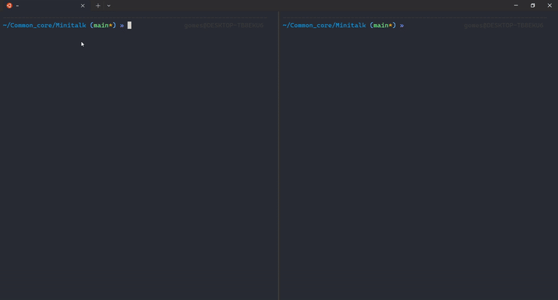

# Minitalk - 42 Project

## Introduction

The Minitalk project at 42 is designed to help students understand inter-process communication (IPC) by implementing a simple message-passing system using UNIX signals. This project involves creating a client-server architecture where the client sends a string message to the server, and the server prints it.

## Concept

Minitalk relies on UNIX signals (```SIGUSR1``` and ```SIGUSR2```) to transmit data between processes. The challenge is to encode characters as signals and ensure proper synchronization between the sender and receiver.

## Mandatory Requirements

  - Implement a server and a client program.
  - The server must:
      - Print its $\color{red}{\textbf{PID}}$ (Process ID) when started.
      - Receive signals from the client and reconstruct the message.
      - Display the received message correctly.
        
  - The client must:
      - Take two arguments: ```server_pid``` and ```message```.
      - Send the message character by character using $\color{Darkorange}{\textbf{SIGUSR1}}$ and $\color{cyan}{\textbf{SIGUSR1}}$.
      - Ensure reliable transmission of characters.
        
## Bonus Features

The bonus part extends the project with:
  - The ability to handle Unicode characters.
  - Improved synchronization between the client and server.
  - Sending acknowledgments from the server to confirm receipt of signals.
    
## Implementation Details

### Signals Used
  - $\color{Darkorange}{\textbf{SIGUSR1}}$ (User-defined signal 1) and $\color{cyan}{\textbf{SIGUSR1}}$ (User-defined signal 2) are used to encode binary data.
  - Each character is sent bit by bit using these signals.
  - The server must interpret the incoming signals and reconstruct the original message.

### Signal Handling
  - The signal or sigaction function is used to set up handlers.
  - The client converts each character into binary and sends the appropriate signals.
  - The server listens for signals and reconstructs the characters.
## Compilation and Usage
To compile the project, use:

```console
cc -Wall -Wextra -Werror server.c -o server
cc -Wall -Wextra -Werror client.c -o client
```

To run the server:
```console
./server
```

To send a message from the client:
```console
./client <server_pid> "Hello, World!"
```
## Example


## Common Pitfalls

  - Incorrect signal handling leading to message corruption.
  - Not handling PID properly, causing failed communication.
  - Sending signals too quickly without proper synchronization.
  - Ignoring edge cases like empty messages or special characters.
    
## Conclusion
The Minitalk project is an excellent introduction to IPC and low-level signal handling in UNIX systems. By implementing this project, students gain a deeper understanding of how processes communicate and how to work with signals efficiently.
